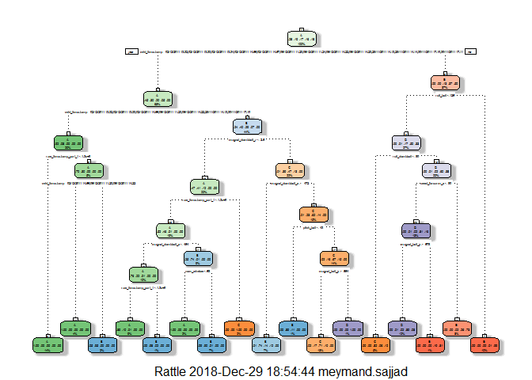
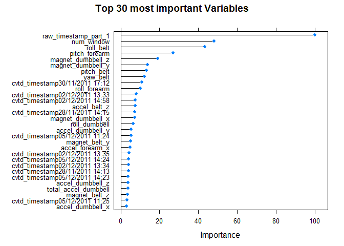

Abstarct
--------

The goal of this project is to predict the manner in which the weight
lifting exercise is done.To accomplish the goal of the project, first
the relevent data ia downloaded and red. Then, the data is cleaned to
remove measuremnets with largely missed or no measuremnets. Then, the
cleaned data is partitioned to training and testing parts to cross
validate different machine learning algorithms. Various machine learning
algorithms such as random forest and decision tree aare implemented on
the data set. The out of bag error is estimated using the validation
data set. These steps are explained here:

reading data
------------

first step is to read the data and acquired the required R pachages.

    f_d <- getwd()
    dt_training <- read.table(paste0(f_d,"/pml-training.csv"),sep = ",",header=T,na.strings=c("NA","#DIV/0!", ""))
    dt_testing <- read.table(paste0(f_d,"/pml-testing.csv"),sep = ",",header=T,na.strings=c("NA","#DIV/0!", ""))

    summary(dt_training)

    # required libraries
    library(caret)

    ## Loading required package: lattice

    ## Loading required package: ggplot2

    library(ggplot2)
    library(caret)
    library(randomForest)

    ## randomForest 4.6-12

    ## Type rfNews() to see new features/changes/bug fixes.

    ## 
    ## Attaching package: 'randomForest'

    ## The following object is masked from 'package:ggplot2':
    ## 
    ##     margin

    library(e1071)
    library(gbm)

    ## Loading required package: survival

    ## 
    ## Attaching package: 'survival'

    ## The following object is masked from 'package:caret':
    ## 
    ##     cluster

    ## Loading required package: splines

    ## Loading required package: parallel

    ## Loaded gbm 2.1.3

    library(survival)
    library(splines)
    library(plyr)
    library(rpart)
    library(rpart.plot)
    library(rattle)

    ## Rattle: A free graphical interface for data mining with R.
    ## Version 4.1.0 Copyright (c) 2006-2015 Togaware Pty Ltd.
    ## Type 'rattle()' to shake, rattle, and roll your data.

    library(RColorBrewer)

cleaning data
-------------

The, clean the data with removing the measurements with high number of
NA’s or near zero variance.

    dt_training <- dt_training[,3:160]

    v_na <- numeric()

    for (i in 1:dim(dt_training)[2]) {
      
      if (sum(is.na(dt_training[,i]))>0.95*dim(dt_training)[1]) {v_na=c(v_na,i)}
    }

    dt_training <- dt_training[,-v_na]
    dim(dt_training)

    ## [1] 19622    58

    #dt_training <- dt_tr[complete.cases(dt_training),]

    v_zv <- nearZeroVar(dt_training, saveMetrics = TRUE)

    dt_training <- dt_training[, v_zv$nzv==FALSE]

    dt_training$classe = factor(dt_training$classe)

    dim(dt_training)

    ## [1] 19622    57

    dt_testing <- dt_testing[, 3:160]
    dt_testing <- dt_testing[, -v_na]
    dt_testing <- dt_testing[, v_zv$nzv==FALSE]

    dim(dt_testing)

    ## [1] 20 57

partitioning data
-----------------

The, the clead data is partitioned to two sets one for training and one
for validation to estimated the error.

    inTrain = createDataPartition(dt_training$classe, p = .6)[[1]]

    dt_training1 =dt_training[ inTrain,]

    dt_cv1 = dt_training[-inTrain,]

Implementing ML algorithms
--------------------------

Two ML algorithms including random forest and decision tree are
implemented.

    set.seed(200)
    mod1 <- rpart(classe ~ ., data=dt_training1, method="class")

    fancyRpartPlot(mod1)

    confusionMatrix(predict(mod1,newdata=dt_cv1, type="class"),dt_cv1$classe)

    ## Confusion Matrix and Statistics
    ## 
    ##           Reference
    ## Prediction    A    B    C    D    E
    ##          A 2158   61    4    2    0
    ##          B   49 1289   90   59    0
    ##          C   25  158 1230  149   51
    ##          D    0   10   22  876   92
    ##          E    0    0   22  200 1299
    ## 
    ## Overall Statistics
    ##                                           
    ##                Accuracy : 0.8733          
    ##                  95% CI : (0.8657, 0.8806)
    ##     No Information Rate : 0.2845          
    ##     P-Value [Acc > NIR] : < 2.2e-16       
    ##                                           
    ##                   Kappa : 0.8397          
    ##  Mcnemar's Test P-Value : NA              
    ## 
    ## Statistics by Class:
    ## 
    ##                      Class: A Class: B Class: C Class: D Class: E
    ## Sensitivity            0.9668   0.8491   0.8991   0.6812   0.9008
    ## Specificity            0.9881   0.9687   0.9409   0.9811   0.9653
    ## Pos Pred Value         0.9699   0.8668   0.7626   0.8760   0.8540
    ## Neg Pred Value         0.9868   0.9640   0.9779   0.9401   0.9774
    ## Prevalence             0.2845   0.1935   0.1744   0.1639   0.1838
    ## Detection Rate         0.2750   0.1643   0.1568   0.1116   0.1656
    ## Detection Prevalence   0.2836   0.1895   0.2056   0.1275   0.1939
    ## Balanced Accuracy      0.9775   0.9089   0.9200   0.8311   0.9331

    set.seed(200)
    mod2 <- train(classe ~ ., data=dt_training1, method="rf")

    v_IO <- varImp(mod2)

    plot(v_IO, main = "Top 30 most important Variables", top = 30)

    confusionMatrix(predict(mod2,newdata=dt_cv1),dt_cv1$classe)

    ## Confusion Matrix and Statistics
    ## 
    ##           Reference
    ## Prediction    A    B    C    D    E
    ##          A 2232    1    0    0    0
    ##          B    0 1517    1    0    0
    ##          C    0    0 1367    4    0
    ##          D    0    0    0 1282    1
    ##          E    0    0    0    0 1441
    ## 
    ## Overall Statistics
    ##                                           
    ##                Accuracy : 0.9991          
    ##                  95% CI : (0.9982, 0.9996)
    ##     No Information Rate : 0.2845          
    ##     P-Value [Acc > NIR] : < 2.2e-16       
    ##                                           
    ##                   Kappa : 0.9989          
    ##  Mcnemar's Test P-Value : NA              
    ## 
    ## Statistics by Class:
    ## 
    ##                      Class: A Class: B Class: C Class: D Class: E
    ## Sensitivity            1.0000   0.9993   0.9993   0.9969   0.9993
    ## Specificity            0.9998   0.9998   0.9994   0.9998   1.0000
    ## Pos Pred Value         0.9996   0.9993   0.9971   0.9992   1.0000
    ## Neg Pred Value         1.0000   0.9998   0.9998   0.9994   0.9998
    ## Prevalence             0.2845   0.1935   0.1744   0.1639   0.1838
    ## Detection Rate         0.2845   0.1933   0.1742   0.1634   0.1837
    ## Detection Prevalence   0.2846   0.1935   0.1747   0.1635   0.1837
    ## Balanced Accuracy      0.9999   0.9996   0.9993   0.9984   0.9997

    mod1$finalModel

    ## NULL

    mod2$finalModel

    ## 
    ## Call:
    ##  randomForest(x = x, y = y, mtry = param$mtry) 
    ##                Type of random forest: classification
    ##                      Number of trees: 500
    ## No. of variables tried at each split: 38
    ## 
    ##         OOB estimate of  error rate: 0.09%
    ## Confusion matrix:
    ##      A    B    C    D    E  class.error
    ## A 3348    0    0    0    0 0.0000000000
    ## B    0 2278    1    0    0 0.0004387889
    ## C    0    4 2048    2    0 0.0029211295
    ## D    0    0    3 1926    1 0.0020725389
    ## E    0    0    0    0 2165 0.0000000000

Error calculation
-----------------

The accuracy level of decision tree is about 87% and for random forest
is about 99%. As the random forest algorithm’s accuracy level suggest,
this method work very well for predicting the outcome of the validation
set.

predictions
-----------

Here is the predict outcome levels on the original Testing data set
using Random Forest algorithm that generated the lowest error rate.

    predict_testset <- predict.train(mod2, dt_testing)
    predict_testset

    ##  [1] B A B A A E D B A A B C B A E E A B B B
    ## Levels: A B C D E

conclusion
----------

The Random Forest method yielded better results. The Confusion Matrix
achieved 99.9% accuracy. The Out of Sample Error achieved 99.7449 %.
Since Random forests works well when there is a large number of inputs,
especially when the interactions between variables are unknow and also
can handle unscaled variables and categorical variables, Random Forest
is selected to be used for the final predictions.
